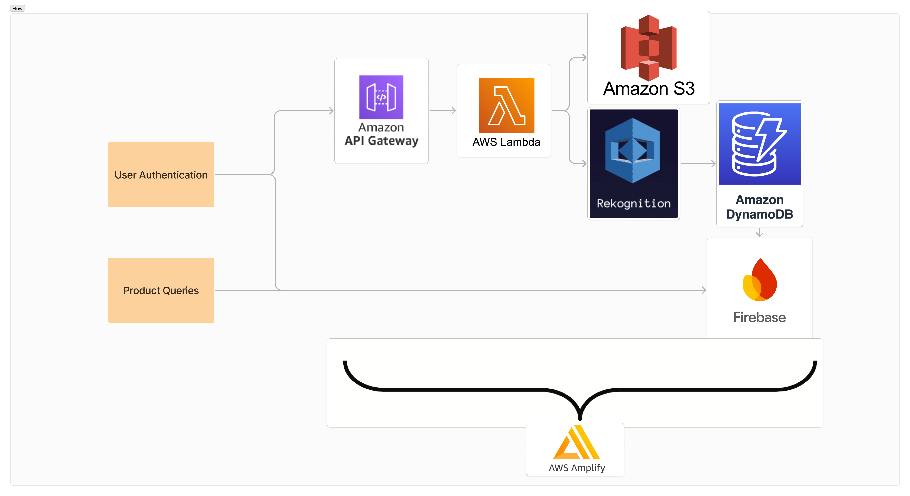

# UniMart

DevPost: https://devpost.com/software/unimart

## Project Goal

UniMart is a university-only platform where students buy, sell, and donate items, reducing waste and promoting sustainability. It offers products with a focus on safety, community, and convenience.

## Stack

- **AWS Services:** Amplify, S3, Lambda, API Gateway, Rekognition, DynamoDB
- **Frontend:** React, Vite
- **Backend:** Node.js
- **Database:** Firebase Realtime Database
- **Styling:** Tailwind CSS, DaisyUI



## How to Run Locally

1. **Clone the repository:**
    ```bash
    git clone https://github.com/jonklein2021/2024-lv-hackathon unimart
    cd unimart
    ```

2. **Install dependencies:**
    ```bash
    npm install
    ```

3. **Run the development server:**
    ```bash
    npm run dev
    ```

4. **Open your browser and navigate to:**
    ```
    http://localhost:5173
    ```

